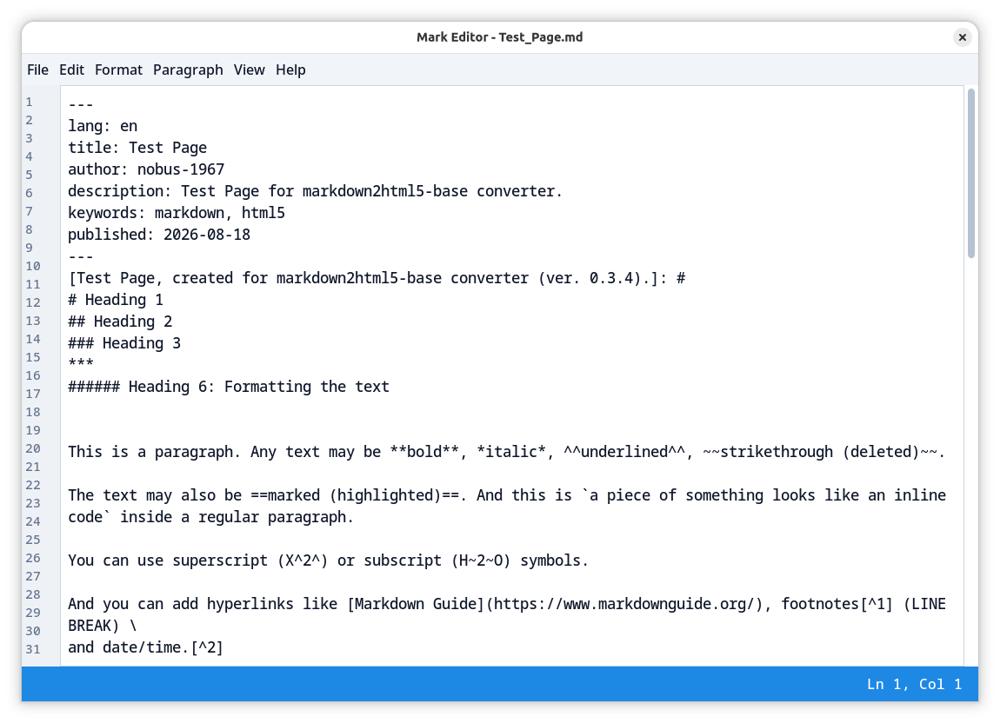

# Mark Editor



A simple Markdown editor that supports standard Markdown, GFM extensions, smart typography, table footers, hidden comments, language markers, ruby annotations for phonetic guides and other add-ons.

## FUNCTIONS

The main functions of the editor:

- select all text;

- edit (cut/copy/paste);

- delete lines (blocks of text);

- undo/redo operations;

- find and replace text;

- format text (bold, italic, underline, strikethrough, subscript, superscript, inline code, marked text);

- add links and footnotes;

- label parts of text as headings, paragraphs, ordered or unordered lists, blockquotes, comments, etc.;

- add fenced code blocks;

- add tables with footers and cell alignment;

- add links to images;

- add horizontal rules;

- add language markers;

- insert ruby annotations (furigana in Japanese texts);

- insert comments (hidden in HTML5/PDF output);

- define YAML Front Matter tags;

- clear formatting;

- add emoji;

- insert CJK language codes (Japanese; Simplified Chinese; Traditional Chinese for Taiwan/Hong Kong; Korean);

- do some typographic replacements;

- create new files, save files (including 'Save As' action using a new file name), open existing files, reopen files (close without saving and open them again);

- open and save files through native GTK file chooser dialogs (zenity), with a fallback to plain Tkinter dialogs when zenity is unavailable;

- quick view Markdown files (using the system default browser);

- export files to other formats (HTML5, plain text and PDF);

- use commands from menus or shortcuts for operations;

- toggle modern light and dark themes.

The editor supports all markup elements listed in the [Full Markdown Functionality Reference](https://github.com/nobus-1967/markdown2html5-base).


## CODE BASE

Since version 0.4.0 the application has been fully rewritten: the code was written from scratch (using parts of version 0.3 that were checked and refactored).

The editor is written as a single Python 3 file (`mark_editor.py`) using Tkinter, [CustomTkinter](https://github.com/TomSchimansky/CustomTkinter) and [CTkMessagebox](https://github.com/Akascape/CTkMessagebox). It is now based on the following Python 3 libraries: [markdown2html5-base](https://github.com/nobus-1967/markdown2html5-base) converts Markdown text into HTML5; [markdown2pdf-base](https://github.com/nobus-1967/markdown2pdf-base) converts and saves files as a PDF using [pandoc](https://pandoc.org/) (xelatex).

## STYLING (CUSTOMTKINTER)

Users can switch between light and dark appearance modes for all interface elements (View menu → Light Theme / Dark Theme, or Toggle Theme with Ctrl+Shift+T). The default theme is `light`. Theme settings are stored in the `~/.config/mark_editor/theme.json` file and restored on the next start. Switching themes restarts the application window; unsaved text is preserved through the cache directory.

## FILE FORMATS

The editor can save files in its own version of Markdown (.md) format and export them to HTML5 (.html) with/without the default CSS3 styles, plain text (.txt) and PDF (.pdf) formats. For CSS styles, see the [Full Markdown Functionality Reference](https://github.com/nobus-1967/markdown2html5-base).

Editor's Markdown format supports basic and extended Markdown syntax of Matt Cone's [Markdown Guide](https://www.markdownguide.org/) and more (language markers, furigana, YAML Front Matter).

## FONTS

The editor requires Google's Noto font family and the Symbola font:

- Noto Sans for the interface, menus and dialog windows;

- Noto Sans Mono (including Noto Sans Mono CJK JP/SC/TC/HK/KR) for text/code (editor and status bar);

- Noto Sans, Noto Sans Mono and Noto Serif CJK (JP/SC/TC/HK/KR) for HTML5/PDF output;

- Symbola for PDF output (emoji and special signs).

## ADD-ONS

### Ruby Annotation/Furigana

Ruby annotation (Japanese furigana) is a reading aid consisting of smaller symbols such as Japanese kana/Chinese hanzi, etc. printed above either kanji/hanzi or other characters to indicate their pronunciation. It is one type of ruby text and the pattern is `{日本語 | にほんご}`, which is equal to `<ruby>日本語<rp>(</rp><rt>にほんご</rt><rp>)</rp></ruby>`.

### YAML Front Matter

YAML Front Matter is a block of metadata written in YAML placed at the very top of a text or Markdown file. It is enclosed by triple dashes (---) on the first line and a closing set of triple dashes or dots. It stores some tags (language definition for the whole document, information about author, title, publication date, short description and keywords) without showing them in the main text.

Example of YAML Front Matter:

```
---
lang: en
title: My Document
author: Jane Doe
description: A short description.
keywords: python, markdown, html5
published: 2026-08-09
---
```

Users can add this metadata to the beginning of a document using the special dialog box (the field `published` is filled in automatically by the system date).

## HOW IT WORKS

See Test_Page in [Markdown](../test_page/Test_Page.md), [HTML5 with CSS3](../test_page/Test_Page.html), [PDF](../test_page/Test_Page.pdf) and [TXT](../test_page/Test_Page.txt).