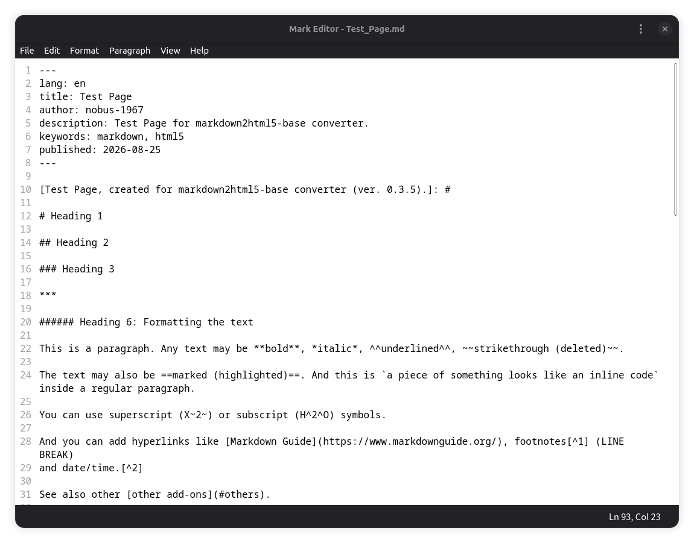

# Mark Editor



A simple Markdown editor that supports standard Markdown, GFM extensions, smart typography, table footers, hidden comments, language markers, ruby annotations for phonetic guides and other add-ons.

## Functions

The main functions of the editor:

- select all text;
- edit (cut/copy/paste);
- delete lines (blocks of text);
- undo/redo operations;
- find and replace text;
- format text (bold, italic, underline, strikethrough, subscript, superscript, inline code, marked text);
- add links and footnotes;
- label parts of text as headings, paragraphs, ordered or unordered lists, blockquotes, comments, etc.;
- add fenced code blocks;
- add tables with footers and cell alignment;
- add links to images;
- add horizontal rules;
- add language markers (from a drop-down list of common tags or a custom BCP 47 tag);
- insert ruby annotations (furigana in Japanese texts);
- insert comments (hidden in HTML5/PDF output);
- define YAML Front Matter tags;
- clear formatting;
- add emoji;
- do some typographic replacements;
- create new files, open and save files (including 'Save As' action using a new file name) through native GTK4 file chooser dialogs, reopen files (close without saving and open them again);
- quick view Markdown files (using the system default browser);
- export files to other formats (HTML5, plain text and PDF);
- use commands from menus or shortcuts for operations;
- toggle modern light and dark themes (live, no restart needed).

The editor supports all markup elements listed in the [Full Markdown Functionality Reference](https://github.com/nobus-1967/markdown2html5-base).

## Code Base

Since version 0.6.0, the application has been rewritten from tkinter/CustomTkinter to GTK4/libadwaita.

The editor is a Python 3 package (`mark_editor/`) using [GTK4](https://gtk.org/), [libadwaita](https://gnome.pages.gitlab.gnome.org/libadwaita/) and [GtkSourceView 5](https://gnome.pages.gitlab.gnome.org/gtksourceview/). It depends on the following Python libraries: [markdown2html5-base](https://github.com/nobus-1967/markdown2html5-base) converts Markdown text into HTML5; [markdown2pdf-base](https://github.com/nobus-1967/markdown2pdf-base) converts and saves files as PDF using [pandoc](https://pandoc.org/) (xelatex).

### Package Structure

```
mark_editor/
  __init__.py        # Package marker
  main.py            # Entry point
  application.py     # Gtk.Application with actions and keyboard shortcuts
  window.py          # Main Gtk.ApplicationWindow + HeaderBar
  editor.py          # GtkSourceView-based editor with built-in line numbers
  dialogs.py         # All dialog classes (Find, Replace, Table, etc.)
  constants.py       # Application constants
  helpers.py         # Resource paths, theme/font persistence, markdown utils
  marks.css          # Custom CSS stylesheet
```

## Styling

Users can switch between light and dark appearance modes for all interface elements (View menu, or Toggle Theme with Ctrl+Shift+T). Theme settings are stored in `~/.config/mark_editor/theme.json` and restored on the next start. Theme switching is instant (no restart needed) via GTK's `gtk-application-prefer-dark-theme` setting.

## File Formats

The editor can save files in its own version of Markdown (.md) format and export them to HTML5 (.html) with/without the default CSS3 styles, plain text (.txt) and PDF (.pdf) formats. For CSS styles, see the [Full Markdown Functionality Reference](https://github.com/nobus-1967/markdown2html5-base).

The editor's Markdown format supports basic and extended Markdown syntax from Matt Cone's [Markdown Guide](https://www.markdownguide.org/) and more (language markers, furigana, YAML Front Matter).

## Fonts

The editor uses:

- The system UI font (Cantarell / platform default) for the interface, menus and dialogs;
- Noto Sans Mono (including Noto Sans Mono CJK JP/SC/TC/HK/KR) for text/code (editor and status bar);
- Noto Sans, Noto Sans Mono and Noto Serif CJK (JP/SC/TC/HK/KR) for HTML5/PDF output;
- Symbola for PDF output (emoji and special signs).

The editor font family and size can be changed via View > Editor Font (Ctrl+Alt+F) and are persisted in `~/.config/mark_editor/theme.json`.

## Requirements

- Python >= 3.10
- GTK 4 (>= 4.12)
- libadwaita 1 (>= 1.4)
- GtkSourceView 5 (>= 5.8)
- PyGObject >= 3.50

## Running the Application

```bash
# Download and unpack the source code
git clone https://github.com/nobus-1967/mark_editor.git
cd mark_editor/application

# Run the application
python3 -m mark_editor.main
```

## Building AppImage

```bash
# Download appimagetool (if not present)
curl -sL https://github.com/AppImage/AppImageKit/releases/download/continuous/appimagetool-x86_64.AppImage -o appimagetool
chmod +x appimagetool

# Build
python3 build_appimage.py
```

Output: `MarkEditor-0.6.2-x86_64.AppImage`

## Add-ons

### Language Markers

Language markers tag a line (`{:de}`) or wrap a selection (`{:fr}…{:}`) with a language-tag prefix. The Language Marker and Language Wrapping dialogs let you pick from a drop-down list of common [BCP 47](https://en.wikipedia.org/wiki/IETF_language_tag) tags (de, de-AT, de-DE, en, en-GB, en-US, es, fr, ja, it, ko, ko-KR, pt, pt-BR, pt-PT, ru, uk, zh, zh-Hans-CN, zh-Hant, zh-Hant-HK, zh-Hant-TW) or enter any other valid BCP 47 tag in the input field below (which starts empty; `en` is preselected in the drop-down).

### Ruby Annotation/Furigana

Ruby annotation (Japanese furigana) is a reading aid consisting of smaller symbols such as Japanese kana/Chinese hanzi, etc. printed above either kanji/hanzi or other characters to indicate their pronunciation. It is one type of ruby text and the pattern is `{日本語 | にほんご}`, which is equal to `<ruby>日本語<rp>(</rp><rt>にほんご</rt><rp>)</rp></ruby>`.

### YAML Front Matter

YAML Front Matter is a block of metadata written in YAML, placed at the very top of a text or Markdown file. It is enclosed by triple dashes (---) on the first line and a closing set of triple dashes or dots. It stores some tags (language definition for the whole document, information about author, title, publication date, short description and keywords) without showing them in the main text.

Example of YAML Front Matter:

```
---
lang: en
title: My Document
author: Jane Doe
description: A short description.
keywords: python, markdown, html5
published: 2026-08-09
---
```

Users can add this metadata to the beginning of a document using the special dialog box (the field `published` is filled in automatically with the system date).

## Temporary Files

The editor uses temporary files to preserve unsaved work and enable quick browser preview:

### New (unsaved) files

- **Temp file**: `~/.cache/mark_editor/Temp.md` — stores unsaved content until the file is saved or the app is closed.
- **Quick view**: `~/.cache/mark_editor/Temp.html` — temporary HTML for browser preview.

### Saved/opened files

- **Temp file**: `<directory>/~<filename>.md` — created before quick view to preserve the current state.
- **Quick view**: `<directory>/~<stem>.html` — HTML preview file with the same name but `.html` extension.

### Cleanup

Temporary files with the `~` prefix are automatically deleted:

- When the user saves the file (Save) or uses Save As;
- When the user quits the application or closes the window.

This ensures the working directory stays clean after the editor session ends.

## How It Works

See Test_Page in [Markdown](./test_page/Test_Page.md), [HTML5 with CSS3](./test_page/Test_Page.html), [PDF](./test_page/Test_Page.pdf) and [TXT](./test_page/Test_Page.txt).